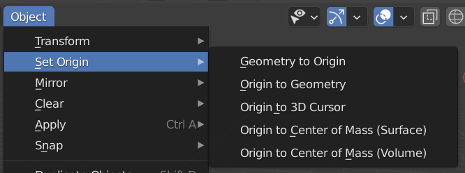

## Set Origin
**SELECT Object > Menu Object > Set Origin**  

- `Geometry to origin`
    - Ponto de transformação passa a se localizar no **centro original padrão** do tipo do objeto selecionado.
- `Origin to geometry`
    - Ponto de transformação passa a se localizar no centro geométrico calculado para o objeto selecionado, considerando o ponto de pivot, por exemplo.
- `Origin to 3D cursor`
    - Ponto de transformação passa a se localizar no 3D cursor
- `Origin to center of Mass (Surface)`
- Ponto de transformação passa a se localizar no Centro de Massa calculado para a área de superfície do objeto selecionado.
- `Origin to center of Mass (Volume)`
- Ponto de transformação passa a se localizar no Centro de Massa calculado para o volume do objeto selecionado.

## 3D Cursor
- `SHIFT` `SPACEBAR` `SPACEBAR` -> Clicar em nova posição para ***3D Cursor***.
- `SHIFT` `C` -> Centralizar ***3D Cursor*** e *view*.
- `TAB EDIT MODE` `1` `SELECT A VERTEX` `SHIFT S` `2` -> Mover ***3D Cursor*** para vertex selecionado.
- `TAB EDIT MODE` `3` `SELECT A FACE` `SHIFT S` `2` -> Mover ***3D Cursor*** para vertex de face selecionada.

## Auxílio para Edição
- `B` -> Mostrar eixo ortogonal para ajudar alinhamento.